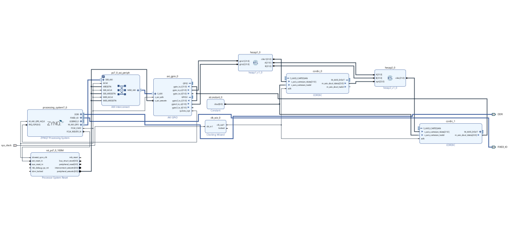

# Cordic-based CoDesign
FPGA has programmable logic (PL) and processor system (PS).  
In this project, we developed a module in PL  
$${\sqrt{\sqrt{A^2+B^2}A*B} }$$ 
  with making this operation in PL we have much faster calculation, and in the PS part, the inputs of the operation are taken and processed in the PL part and the output is sent to the computer.
### Block Diagram of The System

  
## Results

The project was developed on the PYNQ Z2 development board with ZYNQ architecture.  
### PYNQ Z2

The PS (Processor) section of ZYNQ is designed to feed the data to a special module to be designed and receive the result.  
Two number inputs are given and it is checked whether the expected output is the same.  
The numbers 10 and 20 are given. At the end of the calculation, the expected result of 14 was reached.

### The Output

## Contributors
- [@ozlemcali](https://www.github.com/ozlemcali) design, development and documentation.

  
